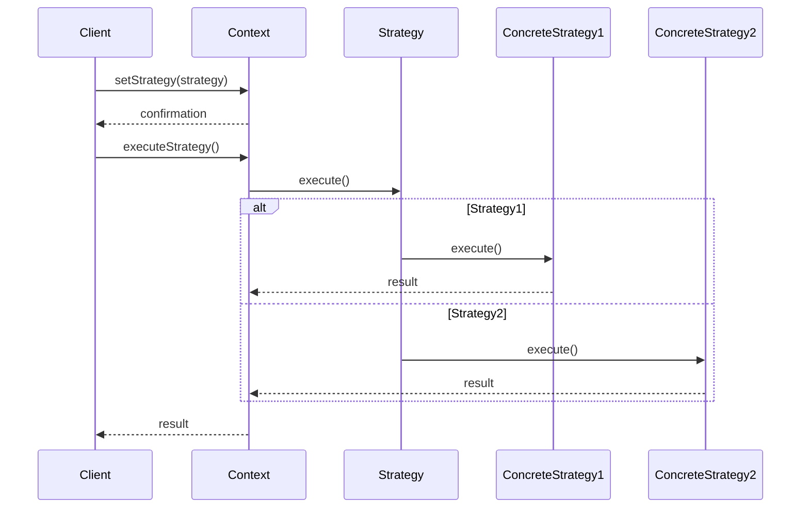

```mermaid
sequenceDiagram
    participant Client
    participant Context
    participant Strategy
    participant ConcreteStrategy1
    participant ConcreteStrategy2
    
    Client->>Context: setStrategy(strategy)
    Context-->>Client: confirmation
    
    Client->>Context: executeStrategy()
    Context->>Strategy: execute()
    
    alt Strategy1
        Strategy->>ConcreteStrategy1: execute()
        ConcreteStrategy1-->>Context: result
    else Strategy2
        Strategy->>ConcreteStrategy2: execute()
        ConcreteStrategy2-->>Context: result
    end
    
    Context-->>Client: result


```