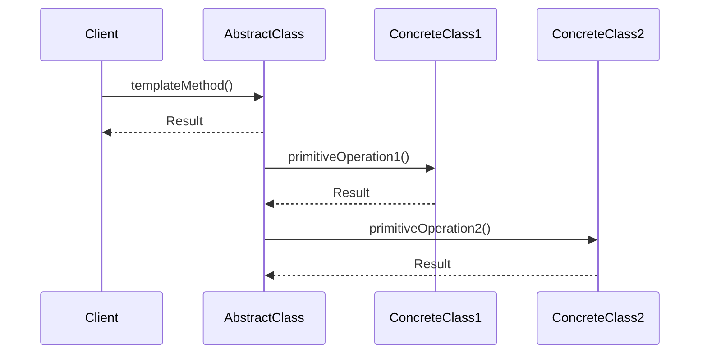

```mermaid

sequenceDiagram
    participant Client
    participant AbstractClass
    participant ConcreteClass1
    participant ConcreteClass2
    
    Client->>AbstractClass: templateMethod()
    AbstractClass-->>Client: Result
    
    AbstractClass->>ConcreteClass1: primitiveOperation1()
    ConcreteClass1-->>AbstractClass: Result
    
    AbstractClass->>ConcreteClass2: primitiveOperation2()
    ConcreteClass2-->>AbstractClass: Result


```