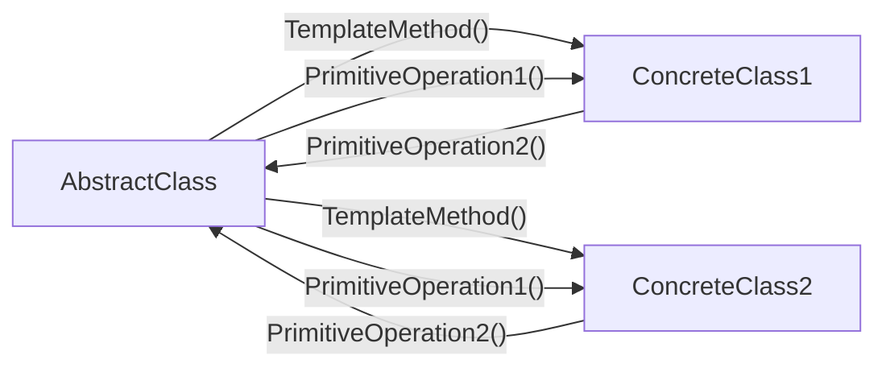

```mermaid 
graph LR
A[AbstractClass] -->|"TemplateMethod()"| B[ConcreteClass1]
A -->|"TemplateMethod()"| C[ConcreteClass2]
A -->|"PrimitiveOperation1()"| B
A -->|"PrimitiveOperation1()"| C
B -->|"PrimitiveOperation2()"| A
C -->|"PrimitiveOperation2()"| A


```