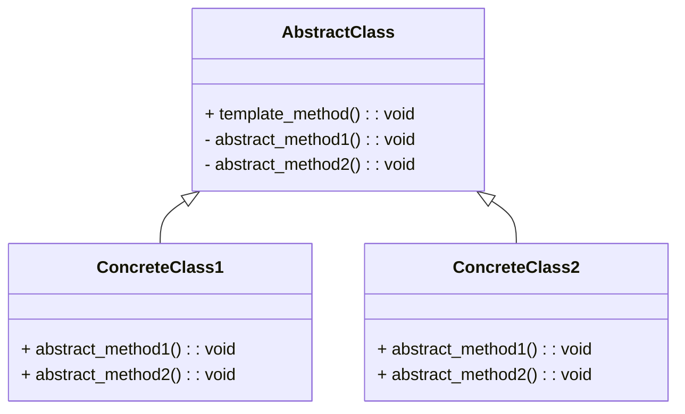

```mermaid 

classDiagram
    class AbstractClass {
        + template_method(): void
        - abstract_method1(): void
        - abstract_method2(): void
    }

    class ConcreteClass1 {
        + abstract_method1(): void
        + abstract_method2(): void
    }

    class ConcreteClass2 {
        + abstract_method1(): void
        + abstract_method2(): void
    }

    AbstractClass <|-- ConcreteClass1
    AbstractClass <|-- ConcreteClass2

```