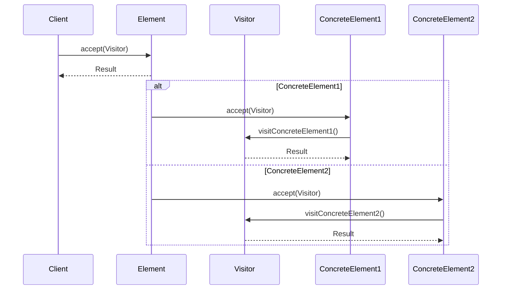

```mermaid
sequenceDiagram
    participant Client
    participant Element
    participant Visitor
    participant ConcreteElement1
    participant ConcreteElement2
    
    Client->>Element: accept(Visitor)
    Element-->>Client: Result
    
    alt ConcreteElement1
        Element->>ConcreteElement1: accept(Visitor)
        ConcreteElement1->>Visitor: visitConcreteElement1()
        Visitor-->>ConcreteElement1: Result
    else ConcreteElement2
        Element->>ConcreteElement2: accept(Visitor)
        ConcreteElement2->>Visitor: visitConcreteElement2()
        Visitor-->>ConcreteElement2: Result
    end


```