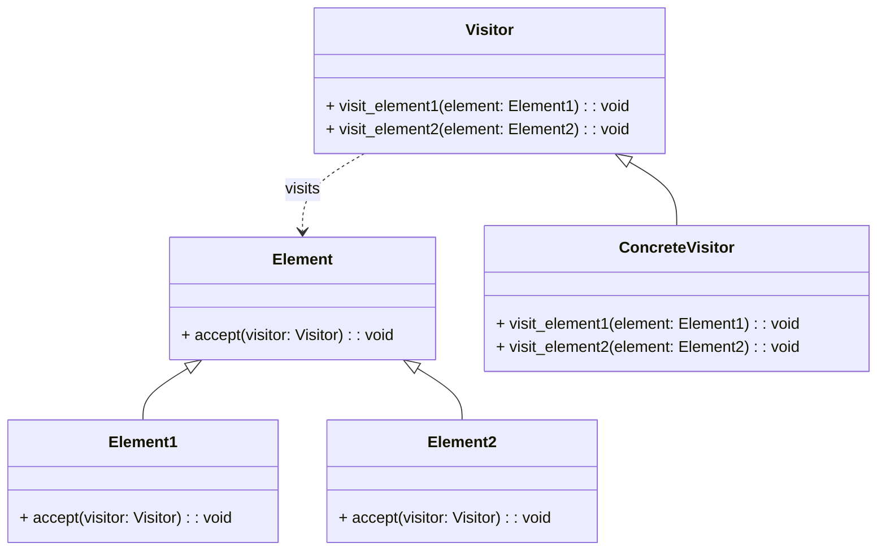

```mermaid 
classDiagram
    class Visitor {
        + visit_element1(element: Element1): void
        + visit_element2(element: Element2): void
    }

    class Element {
        + accept(visitor: Visitor): void
    }

    class Element1 {
        + accept(visitor: Visitor): void
    }

    class Element2 {
        + accept(visitor: Visitor): void
    }

    class ConcreteVisitor {
        + visit_element1(element: Element1): void
        + visit_element2(element: Element2): void
    }

    Visitor <|-- ConcreteVisitor
    Element <|-- Element1
    Element <|-- Element2
    Visitor ..> Element: visits


```